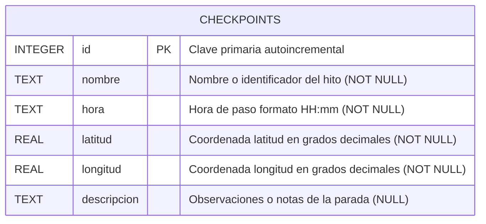
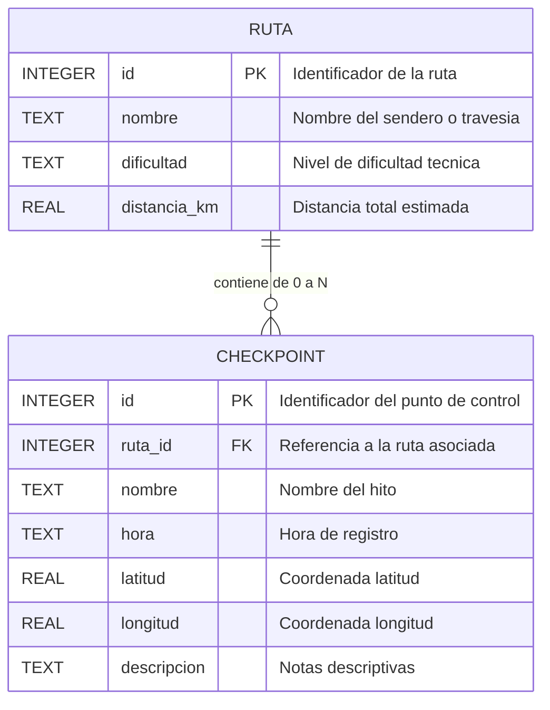

# Diagrama Entidad-Relación - Base de Datos Bitácora

Este documento describe el modelo de datos, la estructura relacional, el diccionario de datos y las consideraciones de persistencia de la aplicación **Bitácora Checkpoints**, implementada sobre **SQLite** mediante JDBC.

---

## 1. Diagrama Entidad-Relación Físico (Modelo Actual SQLite)

A nivel de persistencia física, la base de datos `checkpoints.db` implementa una entidad central (`checkpoints`) que almacena de forma autónoma los puntos de control registrados a lo largo de una travesía o bitácora de ruta.



---

## 2. Diagrama Entidad-Relación Conceptual (Dominio de Trekking)

En el marco conceptual del proyecto académico y la tesina de trekking, los puntos de control forman parte de una bitácora de ruta. Aunque en la etapa actual de prototipo la ruta se modela de manera implícita por el conjunto de checkpoints ordenados temporalmente, la relación conceptual con la entidad `Ruta` o `Bitacora` se visualiza a continuación:



---

## 3. Diccionario de Datos

Detalle exhaustivo de cada campo que compone la tabla física `checkpoints`:

| Columna | Tipo SQLite | Tipo Java / JavaFX | Nulable | Restricciones / Reglas de Negocio | Descripción |
|---|---|---|---|---|---|
| `id` | `INTEGER` | `long` / `LongProperty` | **NO** | `PRIMARY KEY AUTOINCREMENT` | Identificador unívoco del punto de control generado secuencialmente por SQLite. |
| `nombre` | `TEXT` | `String` / `StringProperty` | **NO** | `NOT NULL`, longitud mínima 1 caracter (tras `trim()`). | Denominación o rótulo del checkpoint (ej. *"Campamento Base"*, *"Abra del Viento"*). |
| `hora` | `TEXT` | `String` / `StringProperty` | **NO** | `NOT NULL`, formato estricto `HH:mm` (24 horas). | Hora estimada o registrada de arribo al punto de control (ej. *"14:30"*). |
| `latitud` | `REAL` | `double` / `DoubleProperty` | **NO** | `NOT NULL`, rango `[-90.0, 90.0]`. | Latitud en coordenadas geográficas WGS84 (grados decimales con signo). |
| `longitud` | `REAL` | `double` / `DoubleProperty` | **NO** | `NOT NULL`, rango `[-180.0, 180.0]`. | Longitud en coordenadas geográficas WGS84 (grados decimales con signo). |
| `descripcion` | `TEXT` | `String` / `StringProperty` | **SÍ** | Opcional (`NULL` permitido). | Texto descriptivo con detalles topográficos, agua, estado del sendero o referencias. |

---

## 4. Definición DDL (Data Definition Language)

El esquema se inicializa automáticamente al arrancar la aplicación dentro de la clase [DatabaseManager.java](file:///home/lucasherediadv/repos/github.com/TesinaTrekking/bitacora/src/main/java/com/bitacora/trekking/dao/DatabaseManager.java):

```sql
CREATE TABLE IF NOT EXISTS checkpoints (
    id INTEGER PRIMARY KEY AUTOINCREMENT,
    nombre TEXT NOT NULL,
    hora TEXT NOT NULL,
    latitud REAL NOT NULL,
    longitud REAL NOT NULL,
    descripcion TEXT
);
```

---

## 5. Arquitectura de Persistencia y Decisiones de Diseño

1. **Motor Embebido Serverless**:
   - SQLite no requiere un servidor ni servicio daemon en segundo plano.
   - El archivo de persistencia física es `checkpoints.db`, ubicado en `~/.bitacora-checkpoints/` (directorio estable del usuario del sistema operativo).
2. **Type Affinity de SQLite**:
   - `INTEGER` almacena números enteros de precisión variable (hasta 64 bits con signo), mapeado a `long` en Java.
   - `REAL` almacena números de punto flotante de 8 bytes conforme a IEEE 754, mapeado a `double` en Java.
   - `TEXT` almacena cadenas de texto codificadas en UTF-8.
3. **Mapeo Objeto-Relacional (DAO Pattern)**:
   - La clase [CheckpointDAO.java](file:///home/lucasherediadv/repos/github.com/TesinaTrekking/bitacora/src/main/java/com/bitacora/trekking/dao/CheckpointDAO.java) encapsula las consultas SQL utilizando `PreparedStatement` parametrizados, mitigando vulnerabilidades de inyección SQL.
   - Mapea las filas del `ResultSet` hacia instancias de la entidad observable [Checkpoint.java](file:///home/lucasherediadv/repos/github.com/TesinaTrekking/bitacora/src/main/java/com/bitacora/trekking/model/Checkpoint.java), que alimenta reactivamente las vistas de JavaFX.
4. **Ciclo de Vida de las Conexiones**:
   - Se emplea el patrón de conexión por operación mediante `try-with-resources`. Dado el volumen de datos de una bitácora desktop y la ligereza del driver `org.xerial:sqlite-jdbc`, este diseño garantiza el cierre determinístico de archivos y recursos sin saturar el sistema de archivos local.
